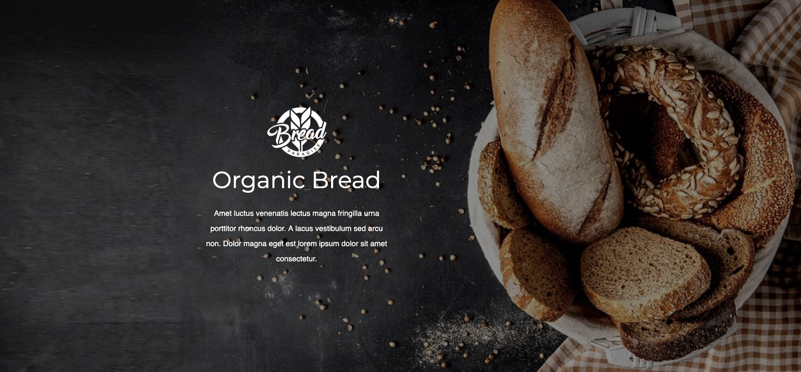

# Bread Paradise

## Описание проекта

**Bread Paradise** — это одностраничный сайт пекарни, который демонстрирует ассортимент продукции, философию компании и предоставляет контактные данные для клиентов. Сайт выполнен с использованием HTML и SCSS и направлен на предоставление удобного пользовательского интерфейса для посетителей.

### Функциональность

- Презентация различных видов выпечки с изображениями и описаниями.
- Краткая информация о миссии и истории пекарни.
- Раздел с контактной информацией, включая адрес и телефон.
- Адаптивная верстка для удобства на мобильных устройствах.

### Используемые технологии

- **HTML5** — структура сайта
- **CSS (SCSS)** — стилизация и адаптивный дизайн
- **БЭМ-методология** — организация классов
- **Gulp** — автоматизация сборки проекта

### Демонстрация проекта

Скриншоты работы проекта и ссылка на демо-версию:



[Посмотреть демо](https://simo680.github.io/bread-paradise/)

### Системные требования

- Установленный веб-браузер (Chrome, Firefox, Edge)

### Инструкция по запуску

1. Склонируйте репозиторий:
   ```sh
   git clone https://github.com/simo680/bread-paradise.git
   ```
2. Перейдите в папку проекта:
   ```sh
   cd bread-paradise
   ```
3. Установите зависимости:
   ```sh
   npm install
   ```
4. Запустите проект:
   ```sh
   npm start
   ```
